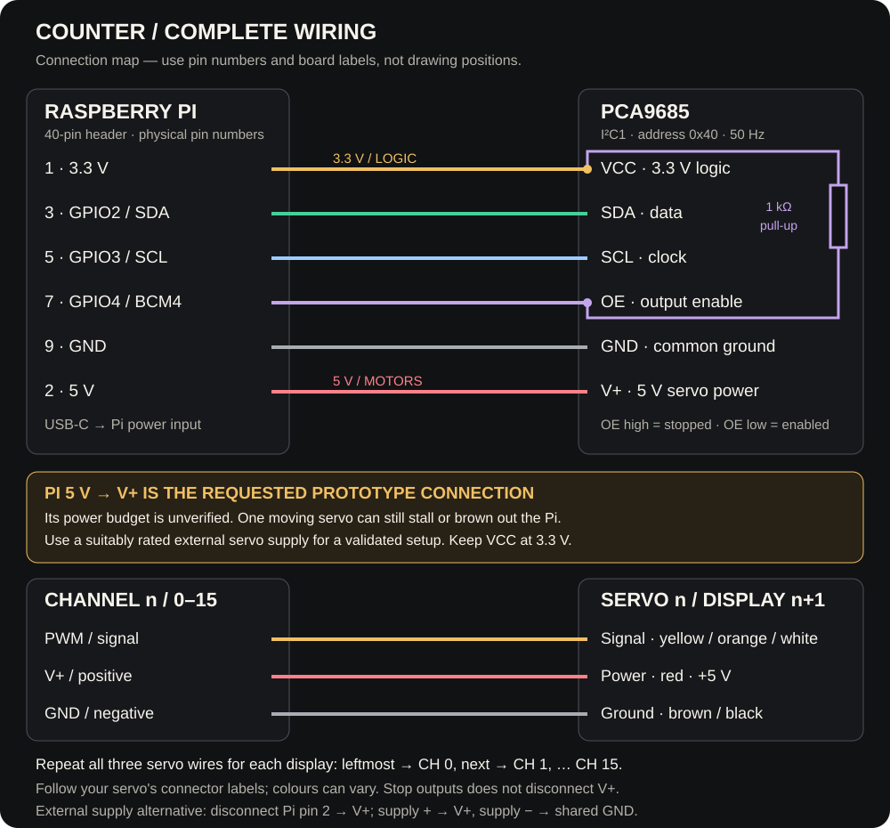

# Counter

A Raspberry Pi dashboard for **1–16 mechanical digit displays**. Each display
has one position-controlled servo that reveals a digit from 0–9. One PCA9685
board provides all sixteen channels. No DC motor, camera, Arduino, or drive
logic is included.

The dashboard uses dark panels, steel-blue controls, and self-hosted
Barlow Condensed / Inter typography. The display preview resembles
the individual windowed digit modules. It works offline after installation.

## Install on Raspberry Pi OS

Use 64-bit Raspberry Pi OS with Python 3.11+, your existing Wi-Fi/Ethernet
connection, and the standard 40-pin GPIO header.

From an existing checkout on your Pi, get the testing build and install it:

```bash
git fetch origin
git switch testing
git pull --ff-only origin testing
bash install.sh --branch testing
```

For a fresh Pi, download the installer directly:

```bash
curl -fsSL https://raw.githubusercontent.com/AloeVeraZ/Counter/testing/install.sh | bash -s -- --branch testing
```

For the main release channel:

```bash
curl -fsSL https://raw.githubusercontent.com/AloeVeraZ/Counter/main/install.sh | bash -s -- --branch main
```

**Testing is experimental and can break installation or servo behavior.**
Both channels need this installer revision for web switching. While these
changes are awaiting review and merge, use `testing`. From a checkout,
`bash install.sh` uses its `main` or `testing` branch; `--branch` explicitly
selects a channel and downloads it when it differs from the checkout.


The installer enables I²C, installs a `counter` service, and **reboots the Pi
after the first successful install**. Wait for it to come back online, then open
**http://PI-IP** (or **http://YOUR-PI-HOSTNAME.local**) and enter the
current password of the Pi account that ran `bash install.sh`. There is no
username field or separate Counter password. Login uses this Pi's local PAM
password check, so different Pis use their own passwords and password changes
apply on the next login. Login does not enable servo outputs.

Subsequent installs and dashboard updates restart Counter without rebooting the
Pi. Counter uses its own service, release directory, and calibration file.
The installer keeps the Pi's existing hostname and network connection.
Stop any other controller using the same hardware before running Counter:
**two programs must never control this PCA9685 / OE pin together**.
The first reboot activates I²C if it was previously disabled. The installer is shipped and tested
for syntax, but has not been executed on a physical Pi in this development run.

Counter's releases live in `/opt/counter/releases`; calibration lives in
`/var/lib/counter/config.json`, outside the release. The service starts with
outputs stopped. Startup, service restarts, and updates do not restore motion.

```bash
sudo systemctl status counter
journalctl -u counter -n 60
```

The installer uses Raspberry Pi OS's **`python3-lgpio`** package and a
virtual environment with access to that system package. It uses
`/usr/bin/python3`, so the GPIO extension matches the OS's Python version and
pip does not have to build an `lgpio` wheel. This follows the
[GPIO Zero virtual environment guidance](https://gpiozero.readthedocs.io/en/latest/installing.html#virtual-environment).

If installation fails, its output names the failing stage. A service startup
failure prints recent service logs and restores the previous active release.
Calibration stays in `/var/lib/counter/config.json`.

## PC simulation (Windows PowerShell)

These commands are for **Windows PowerShell**, not the Pi’s Bash terminal.
Python 3.11 or newer:

```powershell
py -m venv .venv
.\.venv\Scripts\python -m pip install -e .
.\.venv\Scripts\counter --simulate
```

Open **http://127.0.0.1:8080**. Simulation never touches GPIO or I²C. Its
calibration is saved in `~/.counter/config.json`; use `--config PATH` to choose
another file. Hardware mode never silently falls back to simulation.

For Linux/macOS simulation (including previewing on a Pi):

```bash
python3 -m venv .venv
.venv/bin/python -m pip install -e .
.venv/bin/counter --simulate
```

Simulation is a preview. For real servos, use the Pi installer above.

## Wire the board

This shows every connection for the requested Pi-powered prototype. Physical
header pin numbers are different from BCM GPIO numbers. The SVG is a connection
map, not the physical order of pins on a particular breakout board.



| Pi physical pin | PCA9685 |
| --- | --- |
| 1 · 3.3 V | VCC (logic power only) |
| 3 · GPIO2 | SDA |
| 5 · GPIO3 | SCL |
| 7 · GPIO4 | OE (active-low output enable) |
| 9 · GND | GND |
| 2 · 5 V | V+ (servo power rail; prototype only, power budget unverified) |

Keep **VCC at 3.3 V** and **V+ at the servo's rated supply voltage (5 V for this
prototype)**. They are separate rails. The six Pi-to-board jumper wires above
include the 5 V wire; the OE pull-up resistor is an additional connection from
OE to VCC / Pi pin 1. Do not tie OE to ground: Counter controls it through pin 7.

The software expects **I²C1, address 0x40, and 50 Hz**. Add an approximately
1 kΩ pull-up from OE to **3.3 V**, so outputs stay disabled before the service
starts. A 10 kΩ pull-up is too weak against the 10 kΩ pull-down found on the
Adafruit breakout; use the stronger pull-up and verify OE is high during boot
on your board. See [Adafruit's OE pull-up guidance](https://forums.adafruit.com/viewtopic.php?t=218997).
Connect digit modules left to right to channels **0, 1, …, count−1**.
For example, `42` on two modules sends digit 4 to channel 0 and digit 2 to
channel 1. Unconfigured channels receive no position commands.

Every servo needs all three wires on its own PCA9685 channel:

| Wire on each servo | PCA9685 channel connection |
| --- | --- |
| Signal (usually yellow, orange or white) | PWM / signal on that channel |
| Power (usually red) | V+ / positive on that channel |
| Ground (usually brown or black) | GND / negative on that channel |

Repeat these three connections for **each** module, up to CH 15. Check the
connector labels on your board and servo rather than relying only on colours.
All channels share V+ and ground, while each has its own PWM signal.

### Servo power

USB-C powers the Pi; VCC powers only the board's logic. The diagram's Pi pin 2
to V+ wire documents the requested prototype, **not a validated power design**.
The PCA9685 does not
generate power for servos. Use a **separate regulated servo V+ supply** at the
voltage required by your servo model, sized for the servos' current (including
stall current), and connect its ground to the board/Pi ground. For that external
supply arrangement, **remove the Pi pin 2 → V+ wire**, connect supply positive
to V+ (or the terminal block +), and supply negative to GND (or the terminal
block −). Never join an external supply's positive rail to the Pi's 5 V rail.
Never power servo V+ from the Pi's 3.3 V rail. Adafruit explicitly advises
against powering servos from the Pi's 5 V rail because it can brown out the Pi:
[PCA9685 power guidance](https://learn.adafruit.com/16-channel-pwm-servo-driver?view=all).

Sixteen configured channels do **not** mean sixteen servos can safely draw
power from the Pi's USB-C input. The proposed proof-of-concept setup takes
servo V+ from the Pi's 5 V header; this is **not a validated or recommended
power configuration**, and Counter cannot measure or limit its current.
Sequential movement and releasing PWM reduce overlapping commanded
movement/holding loads, but do not establish a safe power budget.
Releasing PWM does not cut power, guarantee zero current, or hold a digit in
place. Stop outputs is a signal stop, not a power disconnect; use a physical
power disconnect where needed.

## Calibrate your digit mechanism

1. In **Calibration → Your setup**, choose the number of modules (1–16). Save.
2. In **Calibration**, select a display and choose **Enable servo control**
   (**Enable preview controls** in PC simulation).
3. Gently test/adjust a pulse to align a digit in the window. Enter that pulse
   in its matching 0–9 row. Repeat for each digit, then save.
4. Repeat for each display. Blank rows remain uncalibrated. Suggested input
   placeholders are **not saved calibration**, and the app refuses to show a
   digit with no saved position.
5. In **Calibration → Test a number**, enter a number. Leading zeros fill unused
   places. The **Display** tab shows the commanded number as a live preview.

Enabling control allows movement commands; it does not itself move a servo.
The same button disables it again, as does **Stop outputs** in the header.
Nothing enables itself on startup.

Each module has its own ten pulse widths, so spacing can be uneven or reversed.
The accepted envelope is 600–2400 µs; that is a software limit, **not a statement
that your servo can safely travel that far**. Use the servo's datasheet and the
mechanism's clearance to choose a narrower actual range. Default settling time
is 500 ms, followed by a default 500 ms pause before the next move; adjust
both to your mechanism. Positions are commanded without
feedback, so the UI cannot confirm physical alignment or detect a stalled or
unplugged servo.

A wheel needing a complete revolution requires a servo with position control
over sufficient travel (or mechanical gearing). A standard 180° servo cannot
directly reach a full 360° wheel. A continuous-rotation servo controls speed and
direction, not absolute position; it needs feedback and a different controller.
The supplied CAD screenshot alone does not establish the required travel.

The goBILDA standard-size category includes several different servo families.
Its regular 2000 Series Dual Mode servos have 300° of position-controlled
travel; the 5-Turn versions have 1800°. Continuous-rotation mode uses PWM to
command speed/direction, not a digit position. Confirm the exact SKU and mode
before choosing pulse limits, travel or settling time. Counter's manual
calibration does not program a servo's operating mode. Sources:
[regular Dual Mode specifications](https://www.gobilda.com/2000-series-dual-mode-servo-25-4-super-speed/),
[5-Turn specifications](https://www.gobilda.com/2000-series-5-turn-dual-mode-servo-25-2-torque/).

The +/− buttons count without wrapping at the maximum. Up to sixteen decimal
digits are kept as strings; no JavaScript floating-point rounding occurs.
Auto count runs while this dashboard is open and visible, waiting for each
move to complete. It pauses on Stop, errors, tab hiding, or range overflow.
From a known last-commanded digit, the worker advances **one neighboring digit
at a time**: for example, 2→3→4, then the next channel. Decreases run in reverse;
9→0 passes through 8,7,…,0 rather than assuming the servo can wrap around a
full turn. Every intermediate digit must be calibrated before motion begins.
Each tick settles, releases that channel's PWM, and pauses before the next
tick. At most one channel receives PWM; a hold mode is no longer available.
The mechanism must retain its displayed digit without servo holding torque.

After startup, Stop during a move, or manual calibration testing, a channel's
position may be unknown. Its first explicit digit command sends the saved
target position to establish a reference. **That first move is not guaranteed
to be a small tick**, because there is no encoder or homing sensor. Nor can
Counter confirm that a released mechanism stayed put. These commands require
a position-controlled servo, not a continuous-rotation servo driven by timing.

Stop interrupts settling and pauses immediately.
Changing calibration/setup stops outputs. An interrupted move is marked unknown
and is sent again when requested after enabling control again. To reduce idle
traffic, the dashboard polls every three seconds with control disabled, every
second with control enabled, and every half second during movement/counting.
A hidden, disabled dashboard polls every fifteen seconds; foregrounding it
refreshes immediately. Stop commands are sent immediately, independently of
the polling interval.

## Updates

In **System → Software updates**, choose **Main · stable releases** or
**Testing · experimental releases**. Both channels are offered regardless of
which one is currently installed. Check for updates, then choose **Update now**
or **Switch to main/testing**. Testing requires acknowledging its warning.
Switching stops outputs, installs the selected channel, and restarts Counter.
Calibration and the Pi account password are preserved. The interface shows
installation progress and failures.

The installed release records its channel in `INSTALL_REF`. Future checks and
updates follow that channel. Checks run in the background with a fifteen-minute
cache; the button refreshes them. Updates run only when requested.

The installer builds/tests a new release before activating it and restores the
previous release if its health check fails. An I²C wiring failure is shown in
the dashboard instead of falling back to simulated hardware. The root-owned
helper accepts only `main`, `testing`, or no arguments (the installed channel,
for compatibility). Sudo permits only those exact commands. The dashboard
cannot supply arbitrary repositories, refs, or shell commands. Keep write
access to release branches restricted to people you trust to install code.

```bash
journalctl -u counter-update -n 100
```

The installed dashboard and all control/calibration/update APIs require a Pi
password login. Login attempts are limited to five per minute across
clients. Sessions expire after eight hours; **Sign out** stops outputs and
clears the browser session. Counter never stores the Pi password. The session
signing key lives beside calibration, outside installed releases. An account
with no usable password cannot log in; set one on the Pi with `passwd`.

Use the dashboard on a **trusted local network**. The default HTTP connection
does not encrypt the Pi password in transit; password login does not add HTTPS.
Do not forward port 80 or 8080 to the
public internet. PC simulation (`--simulate`) remains accessible without a Pi
password. The public `/health` endpoint exposes only the installed commit for
installer readiness checks.

## Development checks

Development changes are pushed to **`testing`** for the repository owner's
review. The owner merges approved changes into **`main`**, which is the release
stable branch offered by the dashboard updater. Do not push development changes directly
to `main`.

To try the review build on a Pi:

```bash
git clone --branch testing https://github.com/AloeVeraZ/Counter.git
cd Counter
bash install.sh
```

For an existing testing checkout, use `git pull --ff-only origin testing` and
run `bash install.sh --branch testing` again. The dashboard can also install
testing updates and switch back to main after those changes are merged.

Run checks before pushing to `testing`:

```bash
python -m unittest discover -s tests -v
```

Tests cover digit mapping, sixteen-digit arithmetic, calibration persistence,
input bounds, interrupted movement, I²C register writes, fail-safe OE behavior,
and dashboard command validation. Hardware and real servo/power performance
still need verification on the actual mechanism.

The bundled fonts retain their SIL Open Font License notices in
`core/counter/static/fonts/`.
